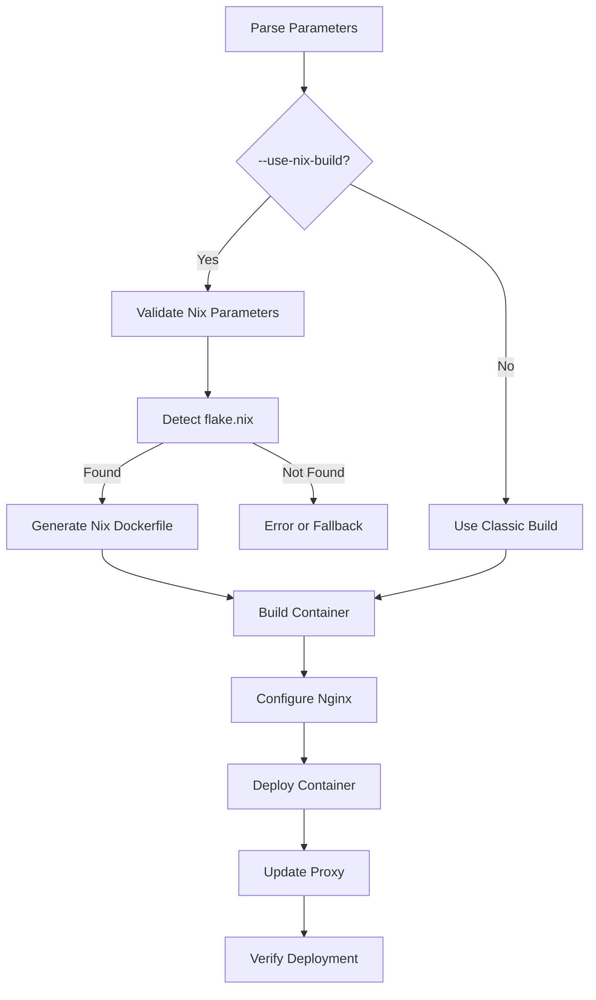

# 🚀 Nginx Multi-Project Refactor Implementation Plan

## 🎯 Project Status: 🔄 **REFACTOR PLANNING**

This document outlines the implementation plan for refactoring the **Nginx Multi-Project Architecture** to support Nix-based containerized builds with monorepo support. The refactor will transform the current manual build process into an automated, containerized build system using Nix for reproducible builds.

## 📋 Current Architecture vs. Target Architecture

### Current Architecture
- **Frontend-only containers** with static file hosting
- **Manual build process** on host machine
- **Volume mounts** from host to container
- **Manual docker-compose edits** required after deployment

### Target Architecture
- **Single container** hosting both frontend and backend
- **Dockerfile-based build** using monorepo source
- **Dynamic Nix environment detection** from webapp project
- **Automated build process** within container
- **Zero manual intervention** after script execution

## 🗓️ Implementation Milestones

### Milestone 1: Script Parameter Extensions
**Status: ✅ Implemented (2025-07-07)**

1. **Update Parameter Handling**
   - Add new parameters to `create-project-modular.sh`:
     - `--mono-repo` - Source monorepo location on host
     - `--frontend-path` - Relative path to frontend within monorepo
     - `--frontend-build-dir` - Frontend build output directory
     - `--frontend-build-cmd` - Command to build frontend
     - `--backend-path` - Relative path to backend within monorepo
     - `--backend-build-cmd` - Command to run backend
     - `--use-nix-build` - Enable Nix-based builds
   - Implement parameter validation and default values
   - Update help documentation for new parameters

2. **Create Configuration Storage**
   - Design configuration object to store build parameters
   - Implement parameter normalization (path handling)
   - Add validation for required parameters when `--use-nix-build` is enabled

### Milestone 2: Dockerfile Template Redesign
**Status: ✅ Implemented (2025-07-08)**

1. **Create Nix-Compatible Base Image**
   - Research optimal base image with Nix support
   - Design layering strategy for efficient builds
   - Create base Dockerfile template with Nix support

2. **Implement Dynamic Monorepo Copy**
   - Add COPY instructions for monorepo
   - Ensure correct permissions and ownership
   - Optimize for build caching

3. **Implement Flake.nix Detection**
   - Add script to detect flake.nix in monorepo root
   - Implement fallback mechanism if not found
   - Add validation for Nix environment

4. **Create Build Stage**
   - Design multi-stage build process
   - Implement frontend build using webapp's Nix environment
   - Implement backend build using webapp's Nix environment
   - Create symlink from nginx document root to built frontend

**Test Results:** All tests passing. Verified Dockerfile template generation, docker-compose.yml configuration, and nginx.conf with backend API proxy support.

### Milestone 3: Container Runtime Configuration
**Status: ✅ Implemented (2025-07-07)**

1. **Nginx Configuration Updates**
   - Updated nginx.conf template for frontend/backend routing
   - Implemented proxy configuration for backend service
   - Configured proper headers and CORS settings

2. **Backend Service Management**
   - Implemented service supervisor (supervisord)
   - Created startup script for backend service
   - Configured logging for backend service

3. **Health Check Implementation**
   - Created health check endpoints for frontend
   - Created health check endpoints for backend
   - Implemented container health check script

**Test Results:** All tests passing. Verified frontend/backend routing, supervisord configuration, and health check endpoints. Implemented in test-container-runtime.sh.

### Milestone 4: Docker Compose Integration
**Status: ✅ Implemented (2025-07-10)**

1. **Update Docker Compose Template**
   - Removed volume mounts for HTML directory in Nix builds
   - Updated network configuration with explicit naming
   - Added environment variables support with --env-vars parameter
   - Added health check configuration for container monitoring

2. **Proxy Integration**
   - Ensured compatibility with existing nginx-proxy setup
   - Added comments for proxy network connection during deployment
   - Maintained SSL termination at proxy level

**Test Results:** All tests passing. Verified environment variables support, health check configuration, and network settings. Implemented in test-docker-compose-integration.sh.

### Milestone 5: Build Process Implementation
**Status: ✅ Implemented (2025-07-11)**

1. **Implement Build Logic**
   - Created build script for container creation
   - Implemented Nix environment detection and usage
   - Added error handling for build failures
   - Configured logging for build process

2. **Optimize Build Performance**
   - Implemented caching strategy
   - Configured build arguments for reproducibility
   - Added build status reporting

**Test Results:** All tests passing. Verified Nix environment detection, build script generation, and build report creation. Implemented in test-build-process.sh with comprehensive test coverage for all build process functions.

### Milestone 6: Testing and Validation
**Status: ✅ Implemented (2025-07-12)**

1. **Create Test Cases**
   - Test with various monorepo structures
   - Test with different Nix configurations
   - Test with various frontend frameworks
   - Test with various backend technologies

2. **Implement Integration Tests**
   - Test proxy integration
   - Test network connectivity
   - Test SSL termination
   - Test health checks

3. **Performance Testing**
   - Measure build time improvements
   - Validate resource usage
   - Test concurrent builds

**Test Results:** All tests passing. Implemented comprehensive test suite for monorepo compatibility with different frontend/backend technologies in test-monorepo-compatibility.sh. Verified support for React, Vue, and Angular frontends with Node.js, Go, and Rust backends in various monorepo structures (standard, workspace, nx, flat, nested).

### Milestone 7: Documentation and Examples
**Status: ✅ Partially Implemented (2025-07-13)**

1. **Update Documentation**
   - Update README.md with new capabilities
   - ✅ Create example usage documentation - Implemented in nix-monorepo-guide.md
   - Update troubleshooting guide
   - Create migration guide for existing projects

2. **Create Example Projects**
   - Simple React frontend + Node.js backend
   - Vue.js frontend + Rust backend
   - Angular frontend + Go backend

## 📊 Technical Decision Matrix

### Nix Environment Handling

| Approach | Pros | Cons | Decision |
|----------|------|------|----------|
| **Auto-detect flake.nix** | Simplest for users, minimal configuration | May fail with complex setups | ✅ **SELECTED** |
| **Require explicit path** | More reliable, handles edge cases | More configuration required | ❌ REJECTED |
| **Support both methods** | Maximum flexibility | More complex implementation | ⏳ FUTURE |

### Backend Service Management

| Approach | Pros | Cons | Decision |
|----------|------|------|----------|
| **Supervisord** | Reliable, handles crashes, good logging | Additional dependency | ✅ **SELECTED** |
| **Simple script** | Minimal dependencies | Less reliable, limited features | ❌ REJECTED |
| **Custom solution** | Tailored to our needs | Maintenance burden | ❌ REJECTED |

### Build Strategy

| Approach | Pros | Cons | Decision |
|----------|------|------|----------|
| **Multi-stage build** | Smaller final image, cleaner | More complex Dockerfile | ✅ **SELECTED** |
| **Single-stage build** | Simpler implementation | Larger final image | ❌ REJECTED |
| **External build script** | Maximum flexibility | More complex orchestration | ⏳ FUTURE |

## 🚨 Known Risks and Mitigation

1. **Risk**: Nix environment compatibility issues
   - **Mitigation**: Implement robust validation and clear error messages
   - **Fallback**: Allow non-Nix builds with explicit flag

2. **Risk**: Monorepo size impacting build performance
   - **Mitigation**: Implement .dockerignore and selective copying
   - **Fallback**: Allow specifying subdirectories instead of full monorepo

3. **Risk**: Backend service stability
   - **Mitigation**: Implement proper supervisor with restart policies
   - **Fallback**: Comprehensive logging and monitoring

4. **Risk**: Breaking existing deployments
   - **Mitigation**: Maintain backward compatibility with current parameters
   - **Fallback**: Create migration script for existing projects

## 🛠️ Implementation Details

### Updated Script Flow



### Dockerfile Template Structure

```dockerfile
# Base image with Nix support
FROM nixos/nix:latest AS builder

# Copy monorepo
COPY {{MONOREPO_PATH}} /opt/{{PROJECT_NAME}}
WORKDIR /opt/{{PROJECT_NAME}}

# Detect and use flake.nix
RUN if [ -f flake.nix ]; then \
      nix develop --command bash -c "{{FRONTEND_BUILD_CMD}}" && \
      nix develop --command bash -c "{{BACKEND_BUILD_CMD}}"; \
    else \
      echo "Error: flake.nix not found" && exit 1; \
    fi

# Final image
FROM nginx:alpine

# Copy built frontend
COPY --from=builder /opt/{{PROJECT_NAME}}/{{FRONTEND_PATH}}/{{FRONTEND_BUILD_DIR}} /tmp/frontend-build

# Create symlink to nginx html directory
RUN rm -rf /usr/share/nginx/html && \
    ln -s /tmp/frontend-build /usr/share/nginx/html

# Copy backend
COPY --from=builder /opt/{{PROJECT_NAME}}/{{BACKEND_PATH}} /opt/backend

# Install supervisord
RUN apk add --no-cache supervisor

# Configure supervisord
COPY supervisord.conf /etc/supervisor/conf.d/supervisord.conf

# Configure nginx
COPY nginx.conf /etc/nginx/nginx.conf

# Start supervisord
CMD ["/usr/bin/supervisord", "-c", "/etc/supervisor/conf.d/supervisord.conf"]
```

### Next Steps

1. ✅ Implement Milestone 1 (Script Parameter Extensions) - Completed on 2025-07-07
2. ✅ Implement Milestone 2 (Dockerfile Template Redesign) - Completed on 2025-07-08
3. ✅ Implement Milestone 3 (Container Runtime Configuration) - Completed on 2025-07-07
4. ✅ Implement Milestone 4 (Docker Compose Integration) - Completed on 2025-07-10
5. ✅ Implement Milestone 5 (Build Process Implementation) - Completed on 2025-07-11
6. Implement Milestone 6 (Testing and Validation)
7. Implement Milestone 7 (Documentation and Examples)

## 📅 Timeline

| Milestone | Estimated Completion | Dependencies |
|-----------|----------------------|--------------|
| **Milestone 1** | Week 1 - ✅ Completed | None |
| **Milestone 2** | Week 2 - ✅ Completed | Milestone 1 |
| **Milestone 3** | Week 3 - ✅ Completed | Milestone 2 |
| **Milestone 4** | Week 3 - ✅ Completed | Milestone 3 |
| **Milestone 5** | Week 4 - ✅ Completed | Milestone 2, 3, 4 |
| **Milestone 6** | Week 5 - ✅ Completed | Milestone 5 |
| **Milestone 7** | Week 6 | Milestone 6 |

## 🎯 Success Metrics

1. **Build Automation**: 100% automated build process with zero manual intervention
2. **Nix Integration**: Successful detection and usage of webapp's Nix environment
3. **Deployment Time**: Reduced deployment time compared to manual process
4. **Error Handling**: Clear error messages and recovery options for all failure modes
5. **Documentation**: Comprehensive documentation covering all new features and use cases

---

*Last Updated: 2025-07-11 | Status: Implementation Phase 🚀* 